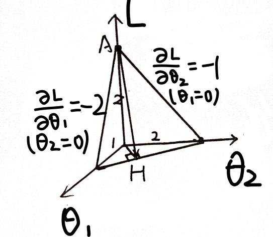
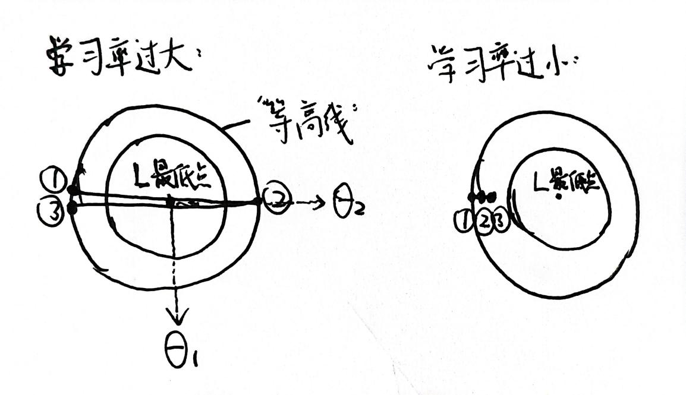

# 1.3 梯度下降与反向传播

> 本文由本地 Word 原稿自动转换而来。图片内容暂不使用自动 OCR；含公式、图示或表格的图片会在后续人工重建为 Markdown/LaTeX。

## 一、梯度下降

1.基本原理

我们现在有了一台“机器”（神经网络），也知道如何给它“打分”（损失函数）。接下来的问题是：AI如何根据这个“分数”来“自我改进”呢？

想象一下，你（AI）站在一个n+1维的巨大山脉（“损失关于n维参数的曲面”）上，山上全是浓雾（全局函数无法直接求解得出）。你的目标是找到海拔最低的“山谷”（Loss最小值）。你看不见谷底在哪，只能往“下降最快”的方向走。

在数学上，梯度（Gradient）是一个向量，它的每一个值代表因变量（Loss）对每个自变量的偏导数值（可以理解为其他变量不变时，因变量对该自变量的导数，即因变量变化量/该自变量变化量的极限）：

$$
\nabla L = \left(\frac{\partial L}{\partial \theta_1}, \frac{\partial L}{\partial \theta_2}, \ldots, \frac{\partial L}{\partial \theta_n}\right)
$$
梯度指示的是参数发生改变时损失的增加量，而我们希望损失下降，所以会在梯度向量前面加一个负号，取它的反方向。对于一个有n个参数的模型，负梯度向量是一个集合了“n个方向陡峭程度”的“指令包”。如第一项代表“只改变θ1时，海拔（L）下降的快慢” 。

比如上图中，只有两个参数，损失L是一个由两个输入决定的函数。损失L在θ1方向的“陡峭度”是-1，θ2方向的“陡峭度”是-2，负梯度向量就是(1, 2)。而“下降最快”的路径AH在参数空间（也就是图中的底面）上的投影OH（即“等高线最密集”的方向）的方向和负梯度向量(1, 2)相同。这也就说明了我们应该沿着负梯度方向下降。

2.学习率调节

我们知道了梯度改变的方向，那么改变多少呢？

一般我们会把负梯度向量乘以一个常数，它称为学习率。这个学习率是一个超参数，它自身无法通过梯度下降法来优化，只能人为调整好。下面两张图是从L轴看，如果学习率过大或过小，参数更新时会出现的问题。如果学习率太大，可能会出现“震荡”的情形，始终无法取到最低点，甚至适得其反；如果学习率太小，会导致步长太小，梯度下降需要的步数更多，计算量和计算开销更大。

3.小批量随机梯度下降

我们知道了梯度下降，但是这里的Loss应该取谁的损失呢？

如果取所有样本的平均，不仅计算开销大，而且因为每一步取的都是相同样本的Loss对参数的函数，缺乏随机性，很容易“陷入”局部最小值，“出不来了”；如果只取一个样本，又随机性太大。因此，我们一般会把样本随机分为多个小批量（Mini-Batch），每次利用一个批量的数据计算Loss对各个参数的负梯度，进行梯度下降，这样就兼顾了准确性、适当的随机性和计算开销。

## 二、反向传播

我们已经知道，AI需要沿着负梯度方向这个“指令包”来下山。但一个关键问题悬而未决：在一个拥有数百万甚至数十亿参数的复杂神经网络中，如何高效地计算出这个包含损失函数对所有参数的梯度（即每个方向的“陡峭度”）的“指令包”呢？

反向传播是一种利用链式法则，从输出层开始，逐层向后（反向）计算损失函数对网络中每一个参数的偏导数的算法。我们可以把它理解为一个精妙的责任与误差分配系统。

1.一个直观的比喻：生产线与责任追溯

想象一个生产巧克力的工厂（神经网络）：输入可可粉、糖、牛奶等原材料（输入数据），经过混合、加热、搅拌、冷却、塑形等多层工序（网络层），输出一块成品巧克力（预测结果），质检品尝后给出评分，比如“太苦了”（计算损失）。现在发现巧克力太苦（损失很大），工厂需要改进。反向传播要解决的问题是：如何精确地知道每一道工序应该承担多少“责任”？是搅拌工序（某一中间层）没搅匀吗？还是加热工序（另一层）温度不对？或者说，根本就是采购的可可粉（输入数据）本身浓度太高？

它会进行精准的责任追溯：

质检员（损失函数） 首先确定最终产品“苦”的程度（损失L输出的梯度），回溯给最后的塑形工序：“你的产品太苦了，偏差量为xxx。”塑形工序收到反馈后想：“我本身只是塑形，苦味主要来自冷却工序传给我的半成品，而且根据我的工艺（激活函数），我对苦味的敏感度是这样的...” 于是它结合自己的“工艺特性”（本地梯度），计算出了对上一道工序（冷却工序）的责任指控，并把这个指控向后传递。这个过程逐层反向进行，每一层都根据后一层传来的“指控”和自身的“工艺说明书”（本地函数和其导数），计算出自己对问题的责任，并继续向更前端的工序追溯。最终，这个误差信号被传递到了最开始的原材料采购（输入层） 和每一道具体的工序。于是，每个环节都清楚地知道了：“哦，我需要为这个‘苦’的结果负XX%的责任。”

2.数学表达

这个“责任追溯”在数学上是通过微积分中的链式法则实现的。链式法则用于计算复合函数的导数。

假设一个简单的网络：输入层x -> 中间层h = f(w1*x) -> 输出层y = g(w2*h) -> 损失L(y)

我们想求损失L关于第一个参数w1的梯度。根据链式法则：
$$
\frac{\partial L}{\partial w_1}=\frac{\partial L}{\partial y}\cdot\frac{\partial y}{\partial h}\cdot\frac{\partial h}{\partial w_1}
$$
反向传播的过程就是从上式右边向左计算：

1. 前向传播：先进行一次完整的从x到L的计算，记录下每一层的中间结果（h，y）。
2. 反向计算：
   a. 首先计算 $\frac{\partial L}{\partial y}$（损失对输出的梯度）。
   b. 然后，将这个梯度乘以 $\frac{\partial y}{\partial h}$（输出对中间层的梯度），得到 $\frac{\partial L}{\partial h}$（损失对中间层的梯度）。这就是将误差从输出层y传递到了中间层h。
   c. 接着，将 $\frac{\partial L}{\partial h}$ 乘以 $\frac{\partial h}{\partial w_1}$（中间层对参数w1的梯度），最终得到我们想要的 $\frac{\partial L}{\partial w_1}$。
同理，L对w2的梯度也就是L对y的梯度乘以y对w2的梯度.计算出L对所有层的梯度后， 执行梯度下降即可。

## 三、梯度消失和梯度爆炸

### （一）原因

在反向传播中，为了计算靠近输入层的参数的梯度，我们需要将后面所有层的梯度连乘起来。对于一个L层的网络，损失对第一层权重 W[1]的梯度：

$$
\frac{\partial L}{\partial W^{[1]}}=\frac{\partial L}{\partial a^{[L]}}\cdot\frac{\partial a^{[L]}}{\partial z^{[L]}}\cdot\frac{\partial z^{[L]}}{\partial a^{[L-1]}}\cdots\frac{\partial a^{[2]}}{\partial z^{[2]}}\cdot\frac{\partial z^{[2]}}{\partial a^{[1]}}\cdot\frac{\partial a^{[1]}}{\partial z^{[1]}}\cdot\frac{\partial z^{[1]}}{\partial W^{[1]}}
$$
在深层网络中，如果其中大部分项的绝对值 小于1，那么连乘的结果会指数级地趋近于0，导致参数更新的幅度变得极小，网络的前面层几乎停止学习，参数更新微不足道。深度网络退化为一个只有后面几层在学习的浅层网络，无法发挥深度模型的表征能力。训练过程变得极其缓慢，甚至完全停滞。

反之，如果大部分项的绝对值 大于1，结果则会指数级地增长到无穷大，导致权重更新的幅度变得极大。参数更新步长巨大且不稳定，导致损失函数剧烈震荡，无法收敛。模型参数可能变成NaN（非数字），因为更新的值超出了计算机的浮点数表示范围。模型完全无法学习到有意义的模式。

### （二）解决方案

1.激活函数选择：使用x＞0时导数恒为1的ReLU函数，而不是在x很大或很小时导数趋于0的Sigmoid函数。

2.参数初始化技巧：后续会介绍。

3.批量规范化：强制将每一层的输入拉回到标准正态分布，以让该层最终整体的梯度尽量接近1。

4.模型架构设计：如ResNet，通过“输出=x+f(x)”的设计（x为输入，f为模型层），建立一条从输入x“直达”输出的“梯度高速公路”，让梯度可以无损地直接流向较浅的层，从根本上解决了深层网络（如上百层的 ResNet）的梯度消失问题。

5.梯度裁剪：针对梯度爆炸，可以在更新权重前，检查梯度的范数（梯度向量的长度）。如果超过设定的阈值，就对梯度在各个方向进行等比例缩放，使其范数（长度）在阈值以内：

如果 $\lVert g\rVert > \text{threshold}$，则：

$$
g\leftarrow \frac{\text{threshold}}{\lVert g\rVert}\cdot g
$$

## 参考文献

暂无已核验参考文献。
