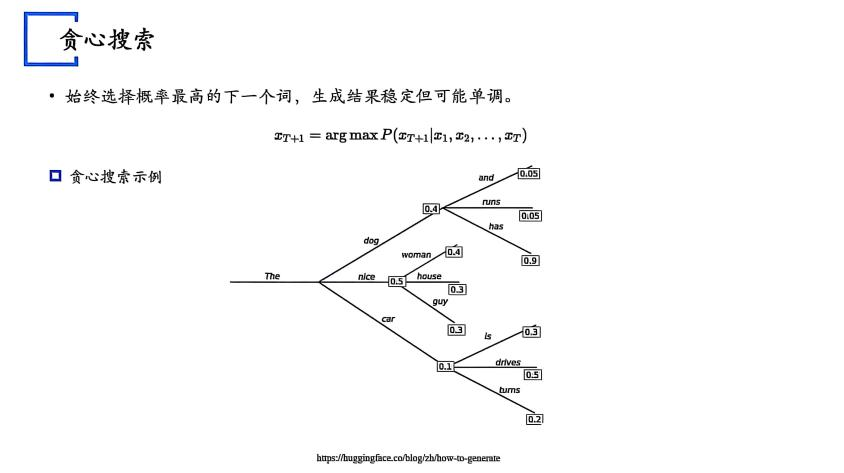
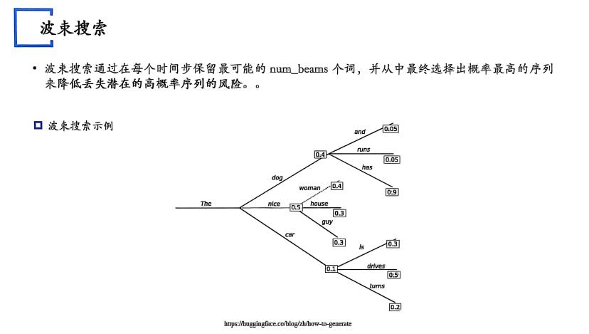
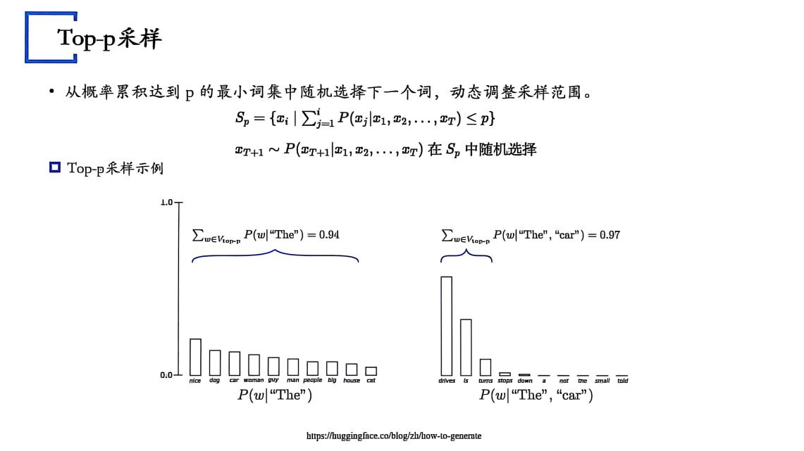

# 16.3 生成过程的干预

## 一、温度（Temperature）

- **高温值（如 1.0）**：增加生成结果的多样性，但可能导致结果不稳定。
- **低温值（如 0.1）**：生成结果更稳定，但可能缺乏创造性。

温度参数控制生成结果的随机性。具体来说，温度参数 $T$ 影响概率分布的“尖锐度”。温度越高，概率分布越平滑，生成结果的多样性越高；温度越低，概率分布越尖锐，生成结果越稳定。

$$
P(x_{T+1} \mid x_1, x_2, \ldots, x_T) =
\frac{\exp\left(\frac{f(x_1,x_2,\ldots,x_T)}{T}\right)}
{\sum_i \exp\left(\frac{f_i(x_1,x_2,\ldots,x_T)}{T}\right)}
$$

其中，$f(x_1,x_2,\ldots,x_T)$ 是模型的内部函数，通常是一个复杂的神经网络，如 Transformer 架构。$T$ 是温度参数，控制概率分布的平滑程度。

## 二、采样（搜索词元）策略

### 贪心搜索

始终选择概率最高的下一个词，生成结果稳定但可能单调。

$$
x_{T+1} = \arg\max P(x_{T+1} \mid x_1, x_2, \ldots, x_T)
$$

贪心搜索示例：图片展示了一个树状图，从 “The” 开始，每一步都选择概率最高的分支，例如 The -> nice (0.5) -> woman (0.4) ...

问题：每步取最高≠乘积最高！

### 波束搜索

波束搜索通过在每个时间步保留最可能的 `num_beams` 个词，并从中最终选择出概率最高的序列，来降低丢失潜在高概率序列的风险。

波束搜索示例：图片展示了树状搜索过程。与贪心搜索不同，它在每一步会保留多个路径，例如 “The nice” 和 “The dog”，然后继续扩展。

**Top-k 采样**：从概率最高的 $k$ 个词中随机选择下一个词，平衡稳定性和多样性。

$$
S_k = \{x_i \mid P(x_i \mid x_1, x_2, \ldots, x_T) \text{ 是前 } k \text{ 高的}\}
$$

$$
x_{T+1} \sim P(x_{T+1} \mid x_1, x_2, \ldots, x_T) \text{，在 } S_k \text{ 中随机选择}
$$

**Top-p 采样（Nucleus Sampling）**：从概率累积达到 $p$ 的最小词集中随机选择下一个词，动态调整采样范围。

$$
S_p = \{x_i \mid \sum_{j=1}^{i} P(x_j \mid x_1, x_2, \ldots, x_T) \le p\}
$$

$$
x_{T+1} \sim P(x_{T+1} \mid x_1, x_2, \ldots, x_T) \text{，在 } S_p \text{ 中随机选择}
$$

下面是Top-p采样的示意图：

也可以将Top-k与Top-p结合：先选K个，再从中选概率p。

## 参考文献

暂无已核验参考文献。
