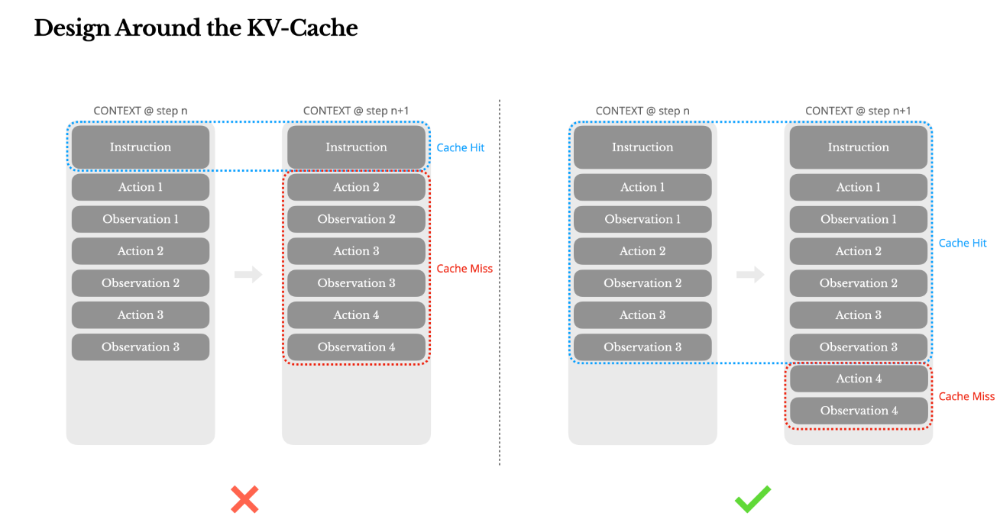
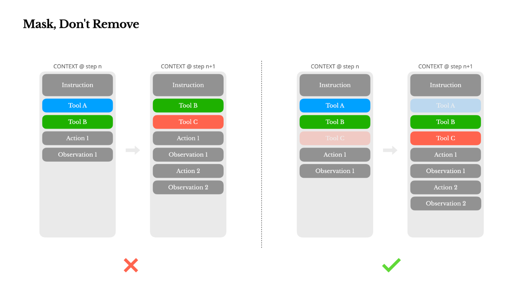
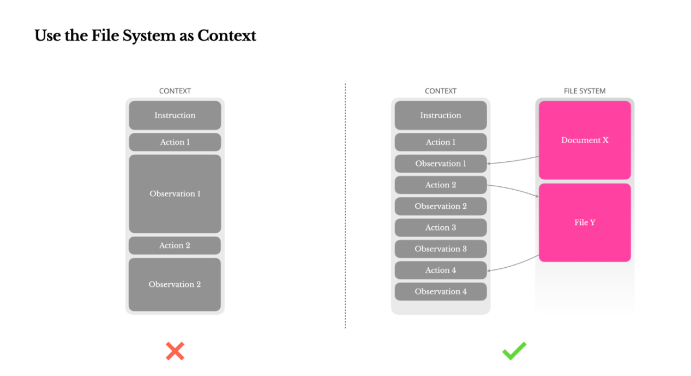
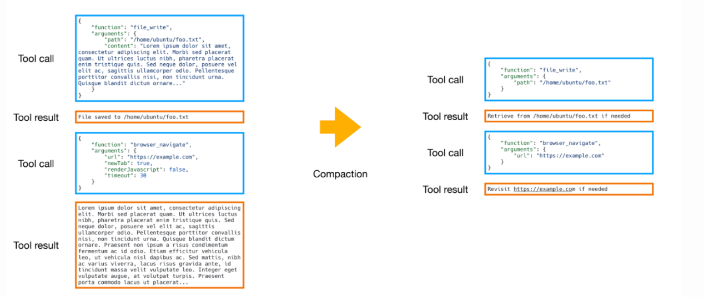
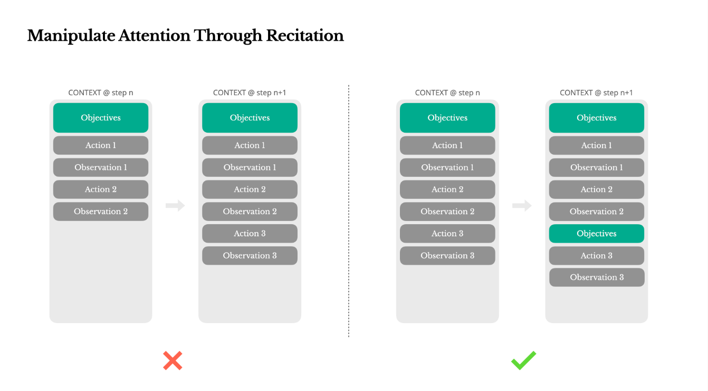
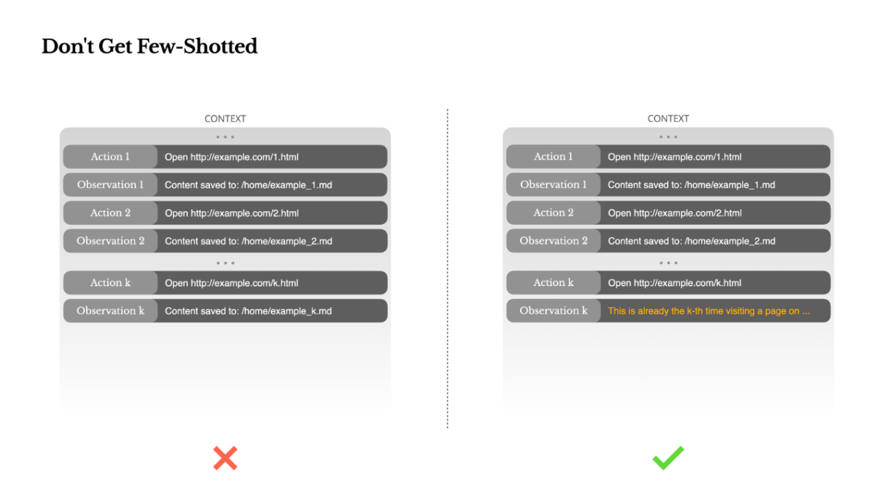
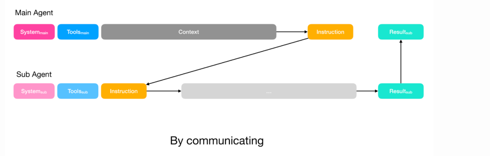
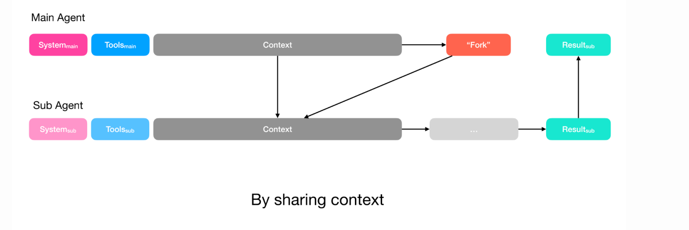

# 26.2 上下文管理

## 一、提高缓存命中率

对于Agent Loop来说，每跑一圈都要把之前的对话历史（包括那些冗长的报错信息、文件内容）重新发给模型，将导致计算复杂度平方级增长。可以采用缓存策略让KV Cache尽可能命中。

从缓存角度，上下文从前到后往往分为：全局缓存（System指令、工具定义）；任务/项目级缓存（如CLAUDE.md，AGENT.md）；会话级缓存（历史对话）；当前会话消息（用户输入、环境反馈结果等）。尽量把静态内容放在前面，动态内容放在后面。对于前面不变的部分，服务器就不需要重新计算，直接调取缓存中的历史记录。

这样可以让长对话的成本从平方级增长降到线性级。但任何改变System指令/工具定义/历史对话等的操作都会导致缓存失效，如中途换模型、切换工作目录、修改权限配置、改变MCP工具列表等。为尽可能确保缓存命中，有以下方法：

1.保持提示前缀稳定。由于LLM的自回归特性，即使是单个标记的差异也会使该标记之后的缓存失效。例如，一些配置修改、工具变更尽量通过在input中附加一条信息，如system propmt的修改可用类似于<system-reminder>的形式实现，而非完全抛弃缓存。一个常见的错误是在系统提示的开头包含时间戳，尤其是精确到秒的时间戳，这会大大降低缓存命中率。

2.使会话上下文只追加。避免修改之前的操作或观察。要当心的是许多编程语言和库在序列化JSON对象时不保证键顺序的稳定性，这可能会悄无声息地破坏缓存。上下文精简尽量在缓存本来就要未命中的时候进行。

3.在需要时明确标记缓存断点。某些模型提供商或推理框架不支持自动增量前缀缓存，而是需要在上下文中手动插入缓存断点。在分配这些断点时，要考虑潜在的缓存过期问题，并至少确保断点包含系统提示的结尾。

## 二、工具管理

随着Agent能力的增强，其行动空间自然变得更加复杂，即工具数量爆炸式增长。如果允许用户自定义工具，总会有人将数百个神秘工具插入到行动空间中。结果，模型更可能选择错误的行动或采取低效的路径，Agent变得更加愚蠢。

一个自然的反应是设计一个动态行动空间，使用类似于RAG的方法按需加载工具，上下文中只包含这些被加载的工具。但实验表明，除非绝对必要，避免在迭代过程中动态添加或移除工具。这一方面是因为工具定义在上下文的前部，任何更改都会使后续所有动作和观察的KV缓存失效，另一方面是因为当先前的动作和观察仍然引用当前上下文中不再定义的工具时，模型会感到困惑，如果没有约束解码，这通常会导致模式违规或幻觉动作。

为了解决这个问题并仍然改进动作选择，有以下方法：

1.只在上下文保留“元工具”，调用这些元工具会将模型导引到文件系统中具体工具存储的位置。这种设计本质上也是渐进式披露，好处在于让工具灵活且可扩展。

以Claude Code的skills为例，技能存储在文件系统中，而非绑定工具，Claude只需调用几个简单的函数（如Bash、文件系统）即可逐步发现和使用技能，然后让模型自主提取需要的技能使用。这个过程只涉及会话上下文的累积，而不涉及上下文最前面工具定义的变化。

Manus也是如此，它只保留了不到20个“原子函数（Atomic Functions）”，如执行Bash命令、读写文件、执行Python代码。复杂的业务逻辑被包装成了沙盒里的CLI（命令行程序），模型不需要知道这几百个MCP工具的JSON Schema。模型只需要知道“我会用Bash”。当它需要使用MCP工具时，它直接在Bash工具里输入类似mcp-cli run some_tool的命令即可。这里也不需要通过语义相似度的向量索引进行检索。

2.只保留工具列表，让模型在需要的时候在文件系统中检索工具定义。GPT-5.4采取的就是这种策略。

3.在需要移除工具时，不直接将工具移出上下文，而是在解码过程中掩蔽token的logits，以基于当前上下文阻止（或强制）选择某些动作，或者通过prompt要求模型禁止使用特定工具（但这本质上变成了注意力机制的博弈，模型仍然有概率“违规操作”生成被禁用的工具）。

函数调用通常有三种模式：

自动：模型可以选择调用或不调用函数。通过仅预填充回复前缀实现：<|im_start|>assistant

必需：模型必须调用函数，但选择不受约束。通过预填充到工具调用令牌实现：<|im_start|>assistant<tool_call>

指定：模型必须从特定子集中调用函数。通过预填充到函数名称的开头实现：<|im_start|>assistant<tool_call>{"name": "browser_"}

## 三、“上下文窗口-文件系统”分层结构

上下文窗口有限，而信息的压缩是不可逆的。为此，我们可以只将重要信息留存在上下文窗口，其余则存储在文件系统中。模型学会按需写入和读取文件，不仅将文件系统用作存储，还用作结构化的外部记忆。

当上下文将满时，模型触发压缩（即在上下文最后加一条消息表示需要压缩）。对于工具调用结果，除了本轮会话以外，前面各轮会话的工具调用结果都会被压缩为指向文件系统中对应内容的索引。

## 四、复述目标

在处理复杂任务时，很多Agent会倾向于创建类似于todo.md的计划文件，并在任务进行过程中逐步更新它，勾选已完成的项目。这不仅是为了方便用户审阅，更重要的是，这是在操控注意力，通过将其目标复述到上下文的末尾的方式，避免模型在复杂任务后期偏离目标。

## 五、不要被少样本示例所困

语言模型是优秀的模仿者；它们模仿上下文中的行为模式。如果上下文充满了类似的过去行动-观察对，模型将倾向于遵循该模式，即使这不再是最优的。这在涉及重复决策或行动的任务中可能很危险。例如，当审查20份简历时，代理通常会陷入一种节奏，即仅仅因为这是它在上下文中看到的，就重复与之类似的行动。这导致偏离、过度泛化，或有时产生幻觉。

解决方法是增加多样性，在行动和观察中引入少量的结构化变化，如不同的序列化模板、替代性措辞、顺序或格式上的微小噪音。这种受控的随机性有助于打破模式并调整模型的注意力。

## 六、多智能体的上下文隔离

在多智能体系统中，主Agent和子Agent（如分别作为规划器和执行器）的上下文会存在一定隔离，如二者的system prompt和tools定义不同的。其余上下文可以不共享，但长上下文的复杂任务中仍建议共享。

不共享的范式：

部分共享的范式：（如主Agent作为规划者，与子Agent共享完整的上下文，子Agent仍拥有自己的动作空间（工具）和指令，但会获得规划者同样可访问的完整上下文。）

在这两种情况下，规划者都定义了子代理的输出模式。子代理有工具在返回结果前填充该模式，Manus 则使用约束解码确保输出符合定义模式。`submit results`

## 参考文献

暂无已核验参考文献。
