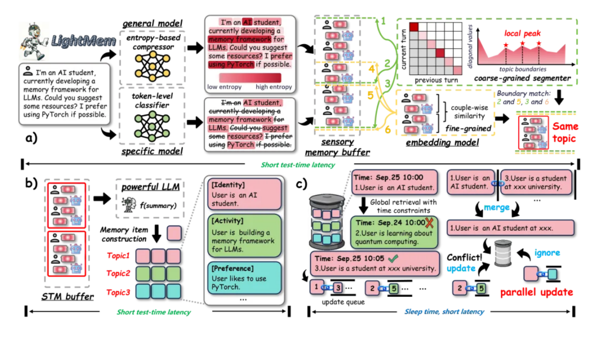

# 27.4 基于上下文和长期记忆的持续学习（论文）

> 本文是论文阅读笔记，内容代表对应论文方法或作者理解，不应直接视为领域共识或工程最佳实践。

## 一、多尺度认知：以ML-Master为例

### （一）核心架构

HCC 将上下文分为三个层级，以应对不同时间尺度的认知需求：

- $L_1$ 缓存：演进经验（Evolving Experience）
  - **作用**：作为智能体的工作记忆，保存当前执行所需的高保真原始轨迹（如当前的研究计划、代码补丁、终端报错和指标日志），用于即时调试和决策。
  - **数学表达**：在当前阶段 $p$ 的时间步 $t$，其缓存状态为 $\mathcal{L}_1(t)=\mathcal{E}_{t_0-1}\cup\mathcal{P}_{p-1}\cup\mathcal{E}_{t_{p-1}+1:t}$。其中 $\mathcal{E}_{t_{p-1}:t}$ 是当前计划的原始执行轨迹。
- $L_2$ 缓存：提炼知识（Refined Knowledge）
  - **作用**：作为中期战略记忆，存储从已完成的探索阶段中提炼出的稳定认知（如关键判断、实验洞察、精简的进度总结）。这让智能体在数十小时的探索中保持战略一致性，而无需携带冗长的执行日志。
  - **数学表达**：$\mathcal{L}_2(t)=\{\kappa_{t_{r-1}+1:t_r-1}\}_{r=1}^{p-1}$，其中 $\kappa$ 是通过大模型对原始事件片段进行提炼后得到的紧凑知识摘要。
- $L_3$ 缓存：先验智慧（Prior Wisdom）
  - **作用**：作为长期记忆，存储跨任务可复用的抽象策略（如鲁棒的模型模板、数据处理流水线）。它使得智能体在面对新任务时能够“热启动”。
  - **数学表达**：存储为嵌入-值对的集合 $\mathcal{L}_3\triangleq(h_n,w_n)_{n=1}^{N}$，其中 $h_n$ 是检索键，$w_n$ 是提炼出的任务级智慧文本。

### （二）工作流

为了在这三个缓存层之间动态流转信息，系统设计了严格的生命周期管理操作：

1. **初始化与上下文预取（Context Prefetching）**：
   - 给定新任务描述 $d_{\tau}$，系统计算其向量嵌入 $q=E(d_{\tau})$。
   - 通过余弦相似度阈值从 $L_3$ 缓存中检索出相关的先验智慧：$\Omega_{\tau}=\{w_n\mid(h_n,w_n)\in\mathcal{L}_3,\cos(q,h_n)>\delta\}$。
   - 将检索到的智慧作为初始上下文，确保智能体在一个高起点的认知下开始探索。
2. **执行与上下文命中（Context Hit）**：
   - 在生成每一步的上下文时，系统优先从 $L_1$ 提取当前活跃阶段的原始经验。
   - 对于过去已经完成的阶段，则退回到 $L_2$ 提取高度浓缩的提炼知识。这有效防止了上下文饱和。
3. **整合与上下文晋升（Context Promotion）**：
   - **阶段级晋升（$P_1$）**：当一个探索阶段结束时，智能体会利用 LLM 的总结能力，将 $L_1$ 中的原始并行探索轨迹压缩成一个精炼的知识单元 $\kappa_p$，写入 $L_2$，并从 $L_1$ 中清理掉对应的原始数据。
   - **任务级晋升（$P_2$）**：当整个机器学习任务完成后，系统会从全局视角提取可复用的策略 $w_{\tau}$，并将其固化到 $L_3$ 缓存中，供未来的任务检索使用。

## 二、轻量级分层记忆：LightMem

LightMem模仿人类的记忆系统，把记忆系统拆成三个轻量模块：

Light1：感官记忆（Sensory Memory），快速过滤无用信息、把输入压缩到“值得记”的部分，并进行主题切分。

具体做法：使用一个轻量压缩模型，在切分时避免“按窗口切”的粗暴做法，而是用注意力信号的峰值找到候选topic边界（见后），再用相邻片段的语义相似度做二次确认，取二者交集作为最终切分点，降低attention sink、注意力稀释等噪声影响导致的“伪峰值”。

怎么用注意力信号找到topic边界：让一个小参数量的语言模型先快速“读”一遍文本，当话题突变，可观察到新Token对旧话题Token的注意力权重A_i,j急剧下降，模型为了满足Softmax的归一化特性，会将注意力强制转移到新话题的起始Token上，这些位置就会形成注意力的局部峰值，通过找出峰值即可确定话题突变位置。

Light2：短时记忆（Short-Term Memory, STM），按主题把对话组织成结构化单元，降低总结调用次数，同时减少主题混杂。

具体做法：在拿到topic segments后，以{topic, turns}的结构送入STM buffer。达到token阈值时，才触发一次LLM总结，对每个topic生成更结构化的summary，并写入LTM。相比“每一轮都总结一次”，这样调用次数降低：总结不再是N次，而是按buffer触发的更少次数；输入被topic约束，不容易“把A主题的细节总结进B主题里”。

Light3：长时记忆（Long-Term Memory, LTM）+睡眠更新（Sleep-time Update），把昂贵的记忆更新从在线推理中“拿出来”，在离线并行地做去重、合并、修复与巩固。

具体做法：为了避免在test time将短时记忆转为长时记忆导致延时，系统在测试时新记忆条目到来时，直接插入LTM，不做复杂更新。离线阶段（sleep time）触发更新，对每个条目构建一个update queue（只允许“新的更新旧的”，即时间戳约束t_j≥t_i），然后把这些更新操作并行执行。

## 三、生成器与记忆管理智能体协同：Agentic Context Engineering

### （一）核心架构

1.生成器（Generator）：接收新的查询并生成推理轨迹（包括有效策略和反复出现的陷阱） 。

2.反思器（Reflector）：批判这些生成的轨迹，从成功和错误中提取具体的经验教训，并可选择在多次迭代中进行提炼。同时，也给原有经验打上“有用”“有害”“中立”等标签。

3.策展人（Curator）：得到新的经验教训后，不重写上下文，而是将新的经验教训综合成紧凑的增量条目（delta entries）。这里的增量条目格式一般为“元数据（如ID，以及记录该条目被标记为“有用”或“有害”次数的计数器等）+内容（具体的策略、领域概念或常见错误等）”。

4.自动化脚本：得出增量条目后，将其确定性地合并到现有的上下文中。具体方式包括：（1）如果是一个带有新ID的新经验，直接追加到上下文列表的末尾；（2）如果是对某条旧规则的反馈，代码直接修改那条旧规则（比如把“有用”次数 +1）；（3）如果发现两条规则在向量空间相似度过高，就删除冗余。

### （二）上下文清理机制

作者认为，如果赋予大模型随意删除或重写整个上下文的权力，它往往会犯“简洁性偏见（Brevity Bias）”的毛病，为了追求简短和通用，大模型很容易把那些看起来有些繁琐但极其关键的“特定领域的启发式方法、工具使用指南或避坑细节”给丢弃掉。在ACE框架中，策展人（Curator）这个大模型角色本身并不负责直接发出“删除”指令，但整个系统确实存在一套机制来删除和清理原有经验，以防止上下文越积越多。

1.语义去重与修剪：当策展人生成了新的经验条目后，底层的传统代码会计算所有经验条目的语义嵌入向量，若文本的语义上高度相似（即存在冗余），系统会自动执行去重并修剪掉多余的内容，用非LLM逻辑自动删除了重复的经验。

2.反思器的“有害”标记：在生成新经验之前，反思器（Reflector）会先对当前生成的轨迹进行复盘，并对上下文中被使用到的原有经验条目打上标签（helpful有用、harmful有害、neutral中立）。虽然策展人只负责输出需要添加的新洞察，但系统会根据反思器的标记来就地更新旧条目的计数器。这些指标可以帮助系统评估哪些经验是无效或起反作用的。

3.延迟提炼机制：修剪和提炼可以配置为主动进行（每次更新增量后都执行），也可以配置为延迟进行，即只有当上下文长度即将超出模型的上下文窗口限制时，才触发清理机制。

## 四、规划与执行Agent的记忆分离式持续学习架构

### （一）基本思想

在多智能体架构中，不同Agent负责规划、执行等，它们总结和需要使用的经验也会有所不同。因此，可将抽象的“规划逻辑”与具体的“执行技巧”分开提取、独立存储、分层检索。负责规划的Agent记忆（高层记忆）中往往是在给定总目标下，制定子目标、调度智能体等的方法和经验，负责执行的Agent记忆（底层记忆）中则是在具体子目标下执行的方法和经验。

### （二）训练工作流

1. **子目标推断（Subgoal Inference）**：

给定一个任务 $x$ 及其完整交互轨迹 $\tau$，利用大模型推断出该轨迹实际达成的一系列离散子目标序列 $s_{1:N}$。

2. **子轨迹推断与分割（Subtrajectory Inference）**：

根据推断出的子目标序列 $s_{1:N}$，将冗长、复杂的完整原始轨迹 $\tau$ 在时间轴上切分为多个局部的子轨迹片段 $\tau_{s_i}$。这使得每一个子轨迹只专注于单一的子目标。

3. **对比反思与洞察提取（Insight Extraction）**：

这是最核心的“萃取”步骤。算法会同时对比同一任务下成功的轨迹 $\tau^{+}$ 和失败的轨迹 $\tau^{-}$。

- **高层萃取**：对比成功的子目标序列和失败的序列，生成或更新全局的高层指导原则 $I_{\mathrm{high}}$（增加、修改、点赞或踩踏现有的 Rule）。
- **底层萃取**：针对特定的子目标，对比成功和失败的子轨迹片段，提取出底层的避错原则 $I_{\mathrm{low}}$。

4. **记忆单元组装与写入（Memory Unit Creation）**：

将上述提取出的 $(x,s,I_{\mathrm{high}})$ 封装入 $\mathcal{M}_{\mathrm{high}}$；将 $(s_i,\tau_{s_i},I_{\mathrm{low}})$ 封装入 $\mathcal{M}_{\mathrm{low}}$。

### （三）测试工作流

当面对一个全新的测试任务 $x_{\mathrm{test}}$ 时，$H^2R$ 采用“规划器（Planner）”与“执行器（Executor）”双重检索机制：

1. **规划器检索（高层）**：

规划器通过预训练的句向量编码器 $\phi(\cdot)$ 计算当前任务与高层记忆库中历史任务的余弦相似度，检索出 Top-$k$ 相关的规划记忆：

$$
\mathrm{sim}(x_{\mathrm{test}},x)=
\frac{\phi(x_{\mathrm{test}})\cdot\phi(x)}
{\|\phi(x_{\mathrm{test}})\|\|\phi(x)\|}
$$

结合检索到的经验，规划器将 $x_{\mathrm{test}}$ 拆解为当前需要的子目标序列。

2. **执行器检索（底层）**：

对于规划器给出的当前子目标 $s_{\mathrm{current}}$，执行器以子目标为 Query，去底层记忆库 $\mathcal{M}_{\mathrm{low}}$ 中进行相似度检索。根据检索到的底层交互技巧和子轨迹，执行器决定具体的原子动作（Atomic Actions），并判断该子目标是否已经完成或失效。

## 五、ReAct的改进：ReMem

在 ReMem 框架内，系统的整个决策循环被视为一个马尔可夫决策过程（Markov Decision Process）。

1. **状态定义**：在时间步 $t$ 且经过 $n$ 次内部操作后，智能体的状态定义为 $s_t^n=(x_t,M_t,o_t^{1:n-1})$，即当前输入、当前记忆以及截至目前的推理轨迹 $o_t$。
2. **动作选择**：智能体在每一步需要从扩展的动作空间中选择一项指令：

$$
a_t^n \in \{\mathrm{Think}, \mathrm{Act}, \mathrm{Refine}\}
$$

3. **执行与状态转移**：智能体基于操作子 Agent 执行动作，输出结果 $o_t^n=\mathrm{Agent}(x_t,M_t,a_t^n)$。

- **Think（思考）**：生成内部的推理思路，帮助分解当前复杂任务，为后续的策略规划提供指导。
- **Refine（精炼）**：对自身的记忆网络执行高阶的元推理（Meta-reasoning）。在这个环节，模型会主动评估历史经验的利用率，召回成功的高价值策略，**剔除（Prune）**导致失败的噪音数据，并对 $M_t$ 进行重新组织，从而为下一步提供更加纯净的高质量信息。
- **Act（行动）**：在虚拟环境（如具身模拟器）中执行具体的命令，或直接向用户输出最终答案。

## 六、其他路径

1.反思式学习：在推理后结合环境反馈自我批评，再把错误经验保留下来，主动从过去中抽取可复用的经验注入上下文。这可以做成跨回合、跨任务的经验积累机制。对代码、交互式任务、工具调用任务尤其有效，因为这类任务反馈信号明确。

2.技能库/程序库：把经验编译成模块化的可复用技能，即不只是记住一段自然语言经验，而是把成功推理/行动压缩成可调用的技能单元。每次成功完成任务后，提取可复用程序、子计划或策略模板，存成skill library，下次遇到相似任务时直接检索并组合技能。相比纯文本memory，技能库更结构化、更可执行，也更利于组合泛化。

## 七、局限性

部分研究指出，长上下文ICL的提升很大程度上来自“检索相似样本”的适配，而不是“持久内化”。

此外，记忆确实能显著提升性能，但在稳定性和程序性经验重用方面依然很脆弱。在真实的非结构化业务场景中，基于提示词驱动的复杂Agent循环极其容易崩溃。如在在ReMem框架中，模型可能会错误地剪枝掉关键记忆，或在Think和Refine步骤中陷入无尽的自我怀疑和死循环，导致迟迟无法执行最终的Act。

·

## 参考文献

- Zhu, X., Cai, Y., Liu, Z., et al. (2026). [Toward Ultra-Long-Horizon Agentic Science: Cognitive Accumulation for Machine Learning Engineering](https://arxiv.org/abs/2601.10402). arXiv:2601.10402.
- Fang, J., Deng, X., Xu, H., et al. (2025). [LightMem: Lightweight and Efficient Memory-Augmented Generation](https://arxiv.org/abs/2510.18866). ICLR 2026.
- Zhang, Q., Hu, C., Upasani, S., et al. (2025). [Agentic Context Engineering: Evolving Contexts for Self-Improving Language Models](https://arxiv.org/abs/2510.04618). ICLR 2026.
- Ye, S., Yu, C., Ke, K., Xu, C., & Wei, Y. (2025). [H2R: Hierarchical Hindsight Reflection for Multi-Task LLM Agents](https://doi.org/10.1109/ICA67499.2025.00030). ICA 2025.
- Wei, T., Sachdeva, N., Coleman, B., et al. (2025). [Evo-Memory: Benchmarking LLM Agent Test-time Learning with Self-Evolving Memory](https://arxiv.org/abs/2511.20857). arXiv:2511.20857.
- Yao, S., Zhao, J., Yu, D., et al. (2023). [ReAct: Synergizing Reasoning and Acting in Language Models](https://arxiv.org/abs/2210.03629). ICLR 2023.
