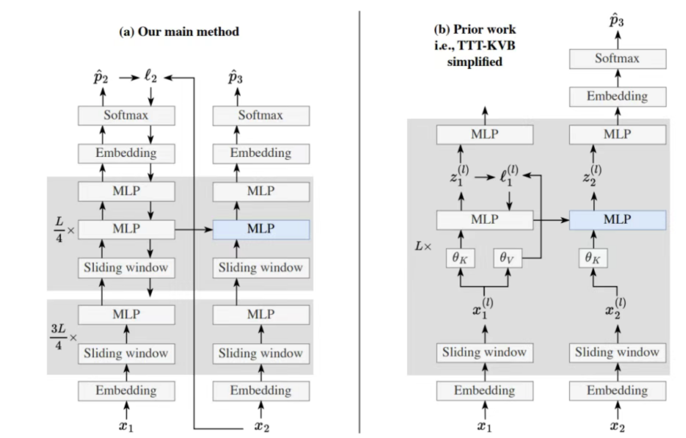

# 29.2 部分权重就地更新的TTT（论文）

> 本文是论文阅读笔记，内容代表对应论文方法或作者理解，不应直接视为领域共识或工程最佳实践。

## 一、TTT-E2E

### （一）核心思想

对于长上下文的处理，在实际生产中，重要的不是一字不落地记住所有细节，而是对上下文建构理解，并将其内化。TTT-End to End（TTT-E2E）提出可以在长上下文处理中，通过在推理时不断用Next token prediction实现持续学习；在训练时，也把目标替换为“进行若干步更新后表现最好”的元学习目标，而不是“冻结参数时开箱即用的表现”，以防止参数漂移、对异常片段的过拟合等。

### （二）模型架构

在推理时，冻结嵌入层（Embedding）、归一化层和注意力层，只更新多层感知机（MLP）的权重，以避免外层循环的梯度不稳定。具体来说，只更新网络最后1/4的Transformer block中的第一个MLP层（为了防止TTT过程遗忘预训练知识，在被更新的block中，额外添加一个静态的第二MLP层作为预训练知识的“安全存储区”；前3/4的Transformer block起表征提取作用，故不动）。

1. **测试时优化：内层循环（Inner Loop）**

在测试阶段，模型接收到上下文后，并非直接一次性输出，而是先利用这些上下文进行自我更新。

- **基础架构**：模型基于标准 Transformer，但将全注意力替换为滑动窗口注意力（Sliding-Window Attention, SWA），窗口大小为 $8K$。
- **Mini-Batch 更新规则**：为了提高并行性和稳定性，TTT 采用小批量更新。对于大小为 $\hat b$ 的小批量，模型权重更新公式为：

$$
W_i = W_{i-1}
- \eta\frac{1}{\hat b}
\sum_{t=(i-1)\hat b+1}^{i\hat b}
\nabla l_t(W_{i-1})
$$

其中 $l_t$ 是标准交叉熵损失函数：

$$
l_t(W)=CE(f(x_{t-1};W),x_t)
$$

2. **训练时元学习：外层循环（Outer Loop）**

如果模型在测试时需要为了测试时更新权重“做好准备”，直接进行 TTT 效果会很差。因此，在预训练阶段，作者使用元学习来寻找最优的初始权重 $W_0$。

- **端到端损失函数**：训练时的目标函数直接等于测试时经过 TTT 更新后的平均损失：

$$
\mathcal{L}(W_0;X)=
\frac{1}{T}\sum_{i=1}^{T/\hat b}\sum_{t=(i-1)\hat b+1}^{i\hat b}
l_t(W_{i-1})
$$

- **梯度反传**：外层循环通过对上述损失求 $W_0$ 的梯度，即隐藏的梯度 $\nabla\mathcal{L}(W_0)$，来优化初始权重，使得模型天生就具备“在测试时快速学习”的能力。

### （三）算法工作流

1. **前向传播（Forward Pass）**：接收给定的上下文 token $x_1$。信号沿着向上的箭头逐层传播。首先经过底部的 embedding 层，然后穿过前 $3L/4$ 个完全冻结的 Transformer 块（仅包含滑动窗口注意力和 MLP）。
2. **局部预测**：信号继续穿过顶部的 $L/4$ 个 Transformer 块。在这部分块中，除了常规网络，还包含一个专门用于 TTT 更新的额外 MLP 层。最终在网络末端输出对下一个词的预测概率分布 $\hat p_2$。
3. **全局损失计算（Global Loss）**：当系统接收到真实的下一个上下文 token $x_2$ 时，在网络的绝对顶端计算标准的交叉熵损失 $l_2$。
4. **误差反向传播（Backward Pass）**：图中的向下箭头代表梯度的反向传播。关键设计在于，梯度仅穿过最后 $L/4$ 个网络块，并在向下传播到 $3L/4$ 的边界处被截断。
5. **状态更新（State Update）**：利用截断的梯度，只更新被标为 TTT 的动态 MLP 层，其他网络参数保持冻结。
6. **循环与未来预测**：现在，将 $x_2$ 作为新的输入，重复上述过程。被更新过的 MLP 使模型具备“记住前文”的能力，从而继续预测未来的 $x_3$。

对比以Titans为代表的“K-V记忆”类Test time training方法：

1. **逐层前向流动**：输入 $x_1$ 经过 embedding 后，进入总共 $L$ 个 Transformer 块的第 $l$ 块，得到局部输入 $x_1^{(l)}$。
2. **键值投影（Key-Value Projection）**：在块内部，输入分别通过外层循环参数 $\theta_K$ 和 $\theta_V$ 进行线性投影，生成当前的 Key 和 Value。
3. **局部代理预测与损失计算**：该层内的 MLP 尝试根据 Key 来预测 Value，得到预测值 $\hat l_1^{(l)}$。随后，将真实 Value 与预测值之间的均方误差作为代理损失：

$$
l^{(l)}_{\mathrm{TTT}}\left(W^{(l)}_{t-1}\right)
=
\left\|g\!\left(\theta_K^{(l)}x_t^{(l)};W^{(l)}_{t-1}\right)
- \theta_V^{(l)}x_t^{(l)}
\right\|^2
$$

4. **局部状态更新**：图中的短向下箭头表示，梯度不会跨层流动。该层只在当前层内部反向传播，更新该层内部特殊 MLP 的权重。
5. **生成该层输出并传递**：当输入 $x_2$ 到达该层得到 $x_2^{(l)}$ 时，使用 $\theta_K$ 投影后，送入更新后的蓝色 MLP，得到该层的最终输出 $z_2^{(l)}$，再传递给更上一层。
6. **顶层预测**：经过所有 $L$ 层的局部更新和前向传递后，在顶层通过 Softmax 预测 $\hat p_3$。

### （四）如何避免在显存中实例化二阶Hessian矩阵？

事实上，元学习的表达式中确实出现了二阶Hessian矩阵：

$$
\nabla_\theta J_{T_i}(\theta_i')
=
\nabla_{\theta_i'}J_{T_i}(\theta_i')
\cdot
\nabla_\theta\theta_i'
=
\nabla_{\theta_i'}J_{T_i}(\theta_i')
\cdot
\left(I+\alpha\nabla_\theta^2J_{T_i}(\theta)\right)
$$

但它是以和向量乘积的形式存在的，简化为考虑Hessain矩阵H和向量v乘积计算的问题：

1. **计算一阶梯度**：对损失函数 $\mathcal{L}$ 做一次常规反向传播，得到一阶梯度向量 $g$：

$$
g=\nabla_\theta \mathcal{L}(\theta)
$$

此时显存开销为 $O(N)$，即存储梯度向量的大小。

2. **构造标量点积**：将梯度向量 $g$ 与目标向量 $v$ 点积，得到纯标量：

$$
S=g^Tv
$$

3. **对标量求一阶导数**：对标量 $S$ 再关于参数 $\theta$ 求梯度：

$$
\nabla_\theta S
= \nabla_\theta(g^Tv)
= (\nabla_\theta g)^Tv
= Hv
$$

这一步实质上是在第一次反向传播建立的计算图上，再进行一次反向传播（reverse-over-reverse autodiff），显存开销仍保持在 $O(N)$。

这样的计算总开销约等于两次独立的前向+反向传播。

### （五）核心计算开销

虽然单个时间步避免了 $O(N^2)$ 的显存操作，但在 TTT-E2E 架构中，系统必须在长达数十万的 token 序列上展开计算图，这仍然引出了另一个维度的灾难。

1. **随时间反向传播（BPTT）的状态膨胀**：
   在传统 RNN 或全注意力 Transformer 中，计算图随时间展开时，隐状态数量会随着序列长度线性增长。但在 TTT-E2E 的内层循环中，模型是将自身参数矩阵 $W$ 作为随着时间演进的“隐状态”来进行持续学习，其内层更新规则类似于：

$$
W_i = W_{i-1} - \eta\nabla_W l_i(W_{i-1})
$$

   外层循环要计算 $\nabla_{W_0}\mathcal{L}$，必须穿过所有时间步反向传播：

$$
\frac{\partial\mathcal{L}}{\partial W_0}
=
\sum_i
\frac{\partial l_i}{\partial W_{i-1}}
\left(
\prod_{j=1}^{i-1}
\frac{\partial W_j}{\partial W_{j-1}}
\right)
$$

   假设内层更新的 mini-batch 大小为 $\hat b=1K$，处理 $T=128K$ 的上下文时，模型实际上要在内层循环中连续走 $128$ 步梯度下降。

2. **致命的显存耗尽（OOM）**：
   为了在反向传播时能计算上述梯度，前向传播必须在显存中保留所有中间状态。在 TTT 中，这意味着超长序列内每个下文切片都要形成一个巨大的权重链 $W_1,W_2,\ldots,W_T$，全部塞进显存。若不保存大部分中间权重，则反向传播时又需要重新计算，时间开销很大。

3. **“用时间换空间”的工程妥协：梯度检查点**：
   工程中可以用梯度检查点（Gradient Checkpointing）减少显存，但仍需要保存较多关键节点，并在反向传播时重新计算前向传播。对于 128K 级别的长上下文，这种方法仍会导致极高的时间成本。

### （六）关于MoE

正如前面所讨论的，TTT-E2E 能高效运行的核心在于把 1K 个 token 打包成一个 mini-batch，利用静态 MLP 计算统一的梯度 $l_t(W)$ 并一次性更新。如果换成 MoE，这 $1024$ 个 token 会被路由网络分配到不同专家：

- 专家 A 可能只收到了 $150$ 个 token 的梯度。
- 专家 B 可能收到了 $300$ 个 token 的梯度。

底层 CUDA 算子无法对这些极其不规则的张量做 coalesced memory access，内存访问、线程排队、负载均衡都会变得困难。

MoE 的核心是门控（Gating）和路由网络，通常使用 Top-K 选择。这是一个不可导或至少高度非线性的过程。如果要在训练期让梯度穿过 TTT 更新步骤，再穿过 MoE 路由机制，其二阶导数的计算会变得不稳定，极易导致梯度爆炸或消失，模型根本无法收敛。

如果我们在架构设计上进行妥协，TTT-E2E 和 MoE 也并非完全不可结合。在 TTT-E2E 的官方实现中，为了保证速度，网络前 $3/4$ 的层是**完全冻结（Frozen）**的，只有最后 $1/4$ 的层参与 TTT 梯度更新。因此可行的折中方案是：

- **前 $3/4$ 的冻结层使用 MoE 架构**：在这里发挥 MoE 的特长，用极低推理算力调用海量参数。
- **后 $1/4$ 的 TTT 层使用稠密（Dense）标准 MLP**：在这里保持规则的 dense 矩阵结构，使 TTT 更新具备高吞吐和稳定性。

### （七）关于推理和Agent能力

Next-token prediction本质上是一种无监督的行为克隆。如果在测试时，强行让模型去拟合一段带有噪声、逻辑跳跃或次优决策的外部Context，确实极易引发“灾难性遗忘”，破坏掉前期通过PPO、GRPO等强化学习算法精调出的长链条推理和任务执行策略。

一种方法时让模型在测试时不去拟合外部给定的 Prompt，而是先利用现有的RL能力生成（或基于其他方法搜索出）高质量的推理步骤，然后结合环境反馈或验证对其经过筛选，利用经过筛选和重述的自身高质量数据来进行对前文所述的MLP模块的TTT更新，这就更类似于后面会提到的自蒸馏方法。

## 二、In-Place TTT

### （一）现有测试时训练（TTT）方法的问题

1.架构不兼容：现有TTT方法往往需要设计全新的独立层来替代自注意力机制，这意味着必须从头开始进行高昂的预训练，无法直接利用现有的模型。

2.计算效率低下：传统的TTT需要逐个Token顺序更新状态，严重限制了现代GPU/TPU的并行计算吞吐量。

3.目标不契合：以往TTT的自监督目标通常是简单的“重建当前词”，这与自回归语言模型“预测下一个词”的终极目标不一致。

### （二）核心架构

为解决上述问题，字节Seed提出了In-Place Test-Time Training框架。该框架不引入全新的网络层，而是直接将Transformer架构中普遍存在的MLP块中的最后一个投影矩阵W_down征用为“快速权重”。这种“即插即用”的设计无需修改原始架构，保留了预训练权重的完整性，仅需极低的成本进行持续微调即可生效。

由于该方法作用于MLP层并与注意力机制互补，它允许以较大的分块为单位进行并行更新，极大地提升了在现代硬件上的吞吐量。

### （三）损失函数

作者通过以下公式构造了一个带有“未来信息”的目标值 $\hat V$：

$$
V = \mathrm{Conv1D}(X_0)W_{\mathrm{target}}
$$

- $X_0$ 是输入 token 最原始的词嵌入向量。
- $\mathrm{Conv1D}(\cdot)$ 是一个一维卷积。它以 3 层引入“未来信息”的核心机制，通过控制卷积核的权重，可以像滑动窗口一样把后面的词拉取过来。
- $W_{\mathrm{target}}$ 是一个可训练的矩阵，负责将卷积提取到的未来特征映射到合适的维度空间。

简单来说，我们希望神经网络最后一层的输出接近这个V值。神经网络最后一层的输出是上一层激活值Z经过权重W_down后得到的。这里预测的词可以是上下文中的任何词，无论由用户、环境输入还是模型生成。

计算损失函数的过程如下：

1. **计算当前输出**：模型使用当前的快速权重 $W_{\mathrm{down}}^{(i)}$ 来处理当前激活值 $Z_{[i]}$，得到输出结果 $O_{[i]}$：

$$
O_{[i]} = Z_{[i]}\left(W_{\mathrm{down}}^{(i)}\right)^T
$$

2. **生成对齐目标**：模型利用 $W_{\mathrm{target}}$ 计算出包含未来信息的标准答案 $\hat V_{[i]}$。
3. **计算损失并更新**：论文定义损失函数为两者之间的负内积：

$$
\mathcal{L}=-\langle O_{[i]},\hat V_{[i]}\rangle_F
=
-\left\langle Z_{[i]}\left(W_{\mathrm{down}}^{(i)}\right)^T,\hat V_{[i]}\right\rangle_F
$$

最小化该负损失等价于最大化 $Z_{[i]}(W_{\mathrm{down}})^\top$ 与 $\hat V_{[i]}$ 之间的相似度。经过 $W_{\mathrm{down}}$ 投影出来的结果如果能够与包含未来预测信息的 $\hat V$ 高度对齐，说明该更新方向有效。

该方法采用极简的一阶更新。因为使用了最简单的内积作为损失函数，它的梯度推导清晰，快速权重更新为：

$$
W_{\mathrm{down}}^{(i)}
=
W_{\mathrm{down}}^{(i-1)}
\eta \hat V_{[i]}^T Z_{[i]}
$$

为了防止 token 越来越多导致权重数值无界增长，论文还引入了 Frobenius 范数裁剪：

$$
\Delta W_{\mathrm{down}}^{(i)}
\leftarrow
\frac{\Delta W_{\mathrm{down}}^{(i)}}{\|\Delta W_{\mathrm{down}}^{(i)}\|_F}
$$

拓展：为什么不用交叉熵？

1.Softmax的计算开销

交叉熵路径中，模型必须把当前 $d_{\mathrm{model}}$ 维隐状态映射到整个词表空间，词表大小可能达到 $50K$ 到 $150K$。然后执行 Softmax、计算概率分布、求出误差，再反向传播穿过 LM Head 回到 MLP 层。TTT 的现实环境通常是推理阶段动态运行，如果每处理一个 chunk 都要做一次词表级别的反向传播，计算开销和显存占用都非常高。

2.梯度公式简洁，易于优化

如果采用非线性 Softmax 产生的高维非线性梯度，需要依赖深度学习框架进行 Top-K 内的大段反向图推导。而内积损失 $C=-(ZW_{\mathrm{down}}^T)\hat V^T$ 的梯度对 $W_{\mathrm{down}}$ 只有极其简单的解析解，避免了大规模反向图的维护和计算。

3.上下文并行的要求

为了实现计算加速，引入了上下文并行机制，利用并行扫描（Parallel Scan / Prefix Sum）来同时处理多个文本块。交叉熵的依赖链中，每一个 token 的分类都需要经过庞大的词表块，而内积损失对每个块而言只依赖于局部的 $Z$、目标 $\hat V$ 和快速权重，梯度天然可以用矩阵加法/乘法组合，从而更容易并行化。

### （四）为什么对推理能力的影响不大？

1.架构层面

In-Place TTT 并没有更新模型所有权重，而是做了一个非常精妙的隔离设计：

- **冻结“通用推理基座”**：模型的核心自注意力机制，以及 MLP 中间的 $W_{\mathrm{up}}$ 和 $W_{\mathrm{gate}}$ 都被完全冻结。作为“慢权重（Slow Weights）”保留了预训练阶段学到的常识逻辑和 agent 规划能力。
- **只更新残差连接的一部分**：它仅将 MLP 的最后一个投影矩阵 $W_{\mathrm{down}}$ 作为可热插拔更新模块。快速权重发生改变时，它实际上是在模型原有大推理路径之上做局部增量特征叠加：

$$
H_{\mathrm{out}} = H_{\mathrm{in}} + \mathrm{MLP}(H_{\mathrm{in}})
$$

当 $W_{\mathrm{down}}$ 发生改变时，它主要是在原有完整推理路径之上增加一段局部记忆增强，不会破坏底层推理能力。

2.目标函数层面

论文指出，在实际工程实现中，这个目标函数并没有局限于单一的下一个 token。

- **局部未来特征的融合**：通过一维卷积 Conv1D 和映射矩阵 $W_{\mathrm{target}}$ 的可学习组合，目标值 $\hat V$ 实际上捕获的是一个局部未来 token 组合信息。
- **与 MTP 思想相似**：这种设计与多 token 预测思路一致。强制模型在隐空间内一次性预测未来的多个演化状态，不仅不会削弱，反而会促进模型进行更深层的前向隐式规划。

### （五）预填充阶段的加速机制：因果填充

在Agent任务中，模型需要在预填充阶段从长上下文中学习。

为了在预填充阶段进行高效训练，In-Place TTT 采用上下文并行（Context Parallelism），将极长的序列切分为多个块（chunk），并让所有 chunk 同时进行各自参数更新量 $\Delta W$。

这带来一个严重问题：理论上论文是为了“预测未来词”，如果在计算 chunk $i$ 最后一个 token 的目标值 $\hat V$ 时，卷积很有可能看到了哪怕一个未来的词，它就会跨界提取到 chunk $i+1$ 的数据。这样就违反了跨块的数据依赖，chunk $i$ 必须等待 chunk $i+1$ 的数据，并行扫描算法的基石就会崩塌。

为确保对 chunk $i$ 的更新量完全不包含未来的信息，作者在生成目标值时对 1D 卷积强行应用了因果填充：

- **常规卷积的视野**：如果卷积核大小为 $5$（即 $K=5$），为了计算位置 $t$ 的特征，通常会取 $[t-2,t-1,t,t+1,t+2]$，这显然包含了未来的信息。
- **因果填充的具体做法**：实现中采用了核大小为 $5$ 且带有因果填充的深度一维卷积。它会在序列左侧手动填充 $4$ 个 $0$。这样一来，在计算位置 $t$ 的特征时，感受野会变为 $[t-4,t-3,t-2,t-1,t]$。

通过这种单向约束，每个 chunk 的计算被严格隔离在自己的边界内。这种局部机制使得高度并行的扫描算法在数学上完全等价于严格的因果序列过程。

当然，解码阶段仍然逐词串行输出和更新权重：

- **Apply**：模型直接使用当前维持的 $W_{\mathrm{down}}$ 对这个 token 进行投影，得到输出。
- **Update**：计算这个 token 带来的较小梯度增量 $\Delta W$，并将其累加到 $W_{\mathrm{down}}$ 中。在这个过程中同样受到很小阈值 $\tau=1e-5$ 的强制裁断保护，防止持续累积退化。

## 参考文献

- Tandon, A., Dalal, K., Li, X., et al. (2025). [End-to-End Test-Time Training for Long Context](https://arxiv.org/abs/2512.23675). arXiv:2512.23675.
- Feng, G., Luo, S., Hua, K., et al. (2026). [In-Place Test-Time Training](https://arxiv.org/abs/2604.06169). arXiv:2604.06169.
