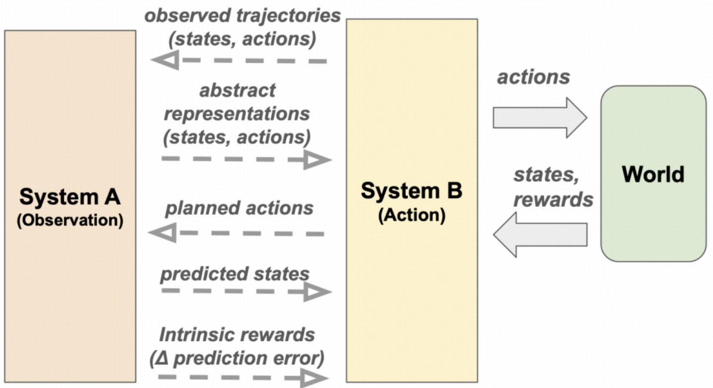

# 29.7 自主学习的智能系统展望（论文）

> 本文是论文阅读笔记，内容代表对应论文方法或作者理解，不应直接视为领域共识或工程最佳实践。

## 一、当前AI的问题

**学习过程的外包**：当前的 AI 模型（如大语言模型）一旦部署，其内部的运行模式便固定下来，本质上无法在真实交互中持续学习新知识。它们的学习过程完全被外包给了人类专家：在被称为 MLOps 的流程中，人类负责收集和清洗数据、调整损失函数、制定严格的训练配方（例如先进行海量自监督预训练，再辅以人类反馈强化学习）。

**领域不匹配（Domain Mismatch）**：因为 AI 的优化是在固定的训练数据分布上进行的，当系统被部署到复杂的现实世界中，面对重启分布的新奇事件或随时间变化的非平稳动态时，其表现会产生不可预测的灾难性下滑。这与生物有机体利用自身环境中的可用数据进行原位适应、快速应对生态位变化的能力形成了鲜明对比。

Yann LeCun等提出了一套受人类和动物认知启发的学习架构，整合了基于观察的学习（System A）和基于主动行为的学习（System B），并能够根据内部生成的元控制信号在这些学习模式之间灵活切换。

## 二、A-B-M自主学习架构

**System A：基于观察的学习（Learning from Observation）**

System A 代表了一种被动接收并处理感觉输入的统计或预测机制。在 AI 中，这类算法的典型代表是自监督学习（SSL）或语言建模。**核心功能**是通过被动观察世界，提取数据的统计分布，抽象出从低级感官特征到高级概念的潜在表征，并构建能够预测未来的“世界模型”。

- **工作流与数学原理**：
  1. 环境数据从分布 $D$ 中采样，即 $x\sim D$。
  2. 任务生成器 $G$ 会从原始样本 $x$ 中生成用于训练的输入与预测目标的配对：

$$
(x_{\mathrm{in}},x_{\mathrm{tar}})=G(x)
$$

  3. 系统通过前向计算和反向传播，学习一个带有参数 $\theta$ 的表征网络 $z_\theta=f_\theta(x)$，以此最小化特定的损失函数 $\mathcal{L}$。优化目标可表示为：

$$
\theta^\* = \arg\min_\theta
\mathbb{E}_{x\sim D}
\left[
\mathcal{L}\left(f_\theta(x_{\mathrm{in}}),x_{\mathrm{tar}}\right)
\right]
$$

**System B：基于行动的学习（Learning from Action）**

System B 则是与世界进行物理互动的代理系统。在 AI 领域，主要对应强化学习（RL）、自适应控制和规划机制。**核心功能**是通过在未知动态世界中执行连续动作试错，观察环境反馈的延迟或稀疏结果，从而优化长期策略以达成特定目标。

- **工作流与数学原理**：
  1. 系统观察世界状态 $s_t$。
  2. 利用代理策略 $\pi$ 在世界动态模型 $M(s_{t+1}\mid s_t,a_t)$ 下预测并生成动作序列 $a_t$。
  3. 系统获取奖励函数 $r(s,a)$ 和新的状态反馈。
  4. 系统不断更新其策略引擎以最大化预期累计回报 $J(\pi)$，优化过程受折扣因子 $\gamma\in[0,1]$ 控制。

**System A 与 B 的相互增强（Symbiotic Interaction）**

- **A 辅助 B**：现实世界的动作空间往往有极高自由度，若寻求无模型强化学习会导致样本爆炸。System A 可以通过提供维度更低的潜在表征、用于前向搜索的预测性世界模型，以及基于预测误差的内部好奇心奖励，极大降低 System B 的探索空间。
- **B 辅助 A**：System A 如果仅靠静态数据容易被噪音淹没。System B 可以通过主动移动视角、采取主动动作去刻意干预世界，为 System A 揭示隐藏的因果关系，并收集目标导向的高信息训练数据。

**System M：元控制中心（Meta-Control Plane）**

为了让机器像自然生物那样在这两种模式间高效切换，论文引入了最终心智模块：System M。

1. **监控资源数据**：System M 本身不处理高清图像或底层电机指令等高带宽数据，它只监控低带宽的“元状态（Meta-states）”。这包括：认识论信号（预测误差、学习增益、不确定性）、物种特异性信号（对目标追踪、潜在危险的硬接线反应），以及躯体信号（电量或能量水平）。
2. **动态数据路由**：基于固定的、通过进化硬编码而来的元策略 $\pi_M(s^m)$，System M 执行元动作。它能够实时切断或连接数据通路，决定系统当前是进入“探索学习模式”还是“利用推理模式”，并将特定的数据动态路由到情景记忆库（Episodic Memory）进行批量处理。

## 三、双层优化

**内循环（发育尺度 Developmental Scale）**：这是单个智能体在其“一生”中的学习过程。利用给定的初始架构参数，系统 A 和系统 B 在固定的 System M 指挥下，与模拟环境实时交互、不断更新参数。

**外循环（演化尺度 Evolutionary Scale）**：在成千上万个模拟生命周期结束后，根据智能体是否完成了手工设计的生存适应度函数 $\mathcal{L}$，通过元学习算法去更新整个种群的“基因参数” $\phi$。

数学形式化：

$$
\phi_{t+1} =
\arg\min_{\phi_t}
\mathcal{L}(A_0:A_K,B_0:B_K)
$$

这一优化必须受到开发育尺度的初始化和交互法则约束：

$$
A_0,B_0,M=\mathrm{Init}(\phi_t)
$$

$$
A_{i+1},B_{i+1}=\mathrm{Update}(M,A_i,B_i,Env)
$$

## 四、高级学习形态展望

在完善的元控制系统下，AI 有望展现出类似于大型哺乳动物和人类独有的高级学习形态：

- **通过沟通/社会化学习（Learning from Communication）**：System M 能够敏锐捕捉社会提示（如目光注视或教学语气），优先处理来自可靠来源（例如人类教师）的高优先级数据流，并快速同步给系统 A 建立新的世界规则。
- **通过想象学习（Learning from Imagination）**：在休息甚至“睡眠”状态下，System M 能切断外部感官和运动输出，从情景记忆中提取经验进行高速回放，利用系统 A 在潜空间中推演长期计划，并在无需真实物理试错成本的情况下更新系统 B 的策略。

总结：这篇论文指出，想实现真正的通用人工智能并越过目前的数据墙，不应只依赖极度“语言中心化”且僵化的范式。AI 需要向认知科学取经，通过一个具有高度自决能力的元控制中心（System M），在“世界建模（观察）”和“具身控制（行动）”之间流畅切换，从而实现可以在部署后持续成长的自主生命体。

## 参考文献

- Dupoux, E., LeCun, Y., & Malik, J. (2026). [Why AI systems do not learn and what to do about it: Lessons on autonomous learning from cognitive science](https://arxiv.org/abs/2603.15381). arXiv:2603.15381.
